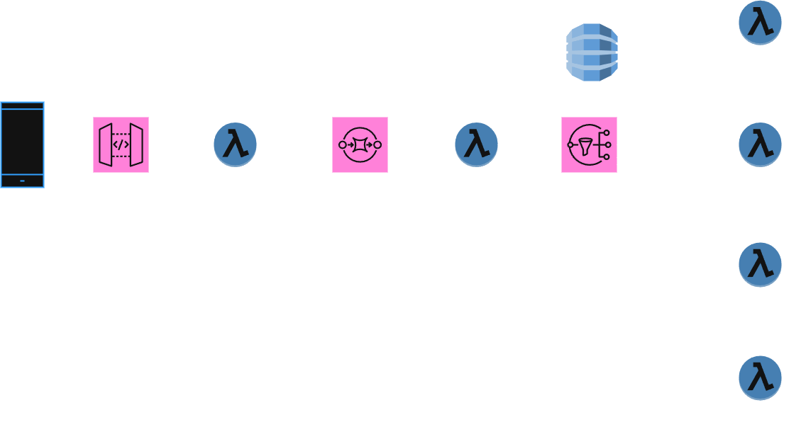

# 🛒 Simulação de Arquitetura de Microserviços para E-commerce na AWS com Python

## 📘 Introdução

Este projeto **simula uma arquitetura de microserviços baseada em eventos**, inspirada em uma aplicação de e-commerce rodando na nuvem da **AWS**.  
O objetivo é demonstrar, de forma prática e local, como diferentes serviços desacoplados podem interagir de maneira **assíncrona** para processar um fluxo de pedido completo.

Cada script Python (`.py`) representa um **microserviço independente**, com uma única responsabilidade, que se comunica através da troca de mensagens, simulando o comportamento de serviços da AWS como **API Gateway**, **Lambda**, **SQS** e **SNS**.  
A abordagem é técnica, mas **simplificada** para facilitar o entendimento dos conceitos fundamentais de **arquiteturas orientadas a eventos**.

---

## 🔁 Fluxo do Projeto

O fluxo de dados começa com o recebimento de um pedido e se ramifica dependendo do resultado do processamento do pagamento.  
Abaixo, detalhamos a jornada de um pedido através da nossa arquitetura simulada.



### ⚙️ Detalhamento dos Microserviços
#### 📨 receber_pedido.py (API Gateway + Lambda)
**Responsabilidade:**
É a porta de entrada do sistema. Recebe os dados do pedido, valida as informações essenciais (id_produto, quantidade) e, se tudo estiver correto, adiciona o pedido a uma fila.

**Simula:**
O comportamento de um API Gateway que invoca uma Lambda para processamento inicial.
A fila utilizada simula o Amazon SQS, garantindo que o pedido será processado mesmo que os serviços seguintes estejam ocupados.

#### 💳 processar_pagamento.py (Lambda Consumidora)
**Responsabilidade:**
“Ouve” a fila de pedidos. Ao receber um novo pedido, simula a comunicação com um gateway de pagamento, resultando em um status de SUCESSO ou FALHA.

**Simula:**
Uma função Lambda acionada por mensagens da fila SQS.
Após o processamento, publica o resultado (mensagem de status) em um tópico, simulando o Amazon SNS (Simple Notification Service).

#### 📡 O Padrão Fan-out (Tópico SNS)
Após o pagamento, o status é publicado em um tópico SNS.
Vários serviços "assinam" esse tópico e recebem a mesma mensagem simultaneamente, agindo de forma independente com base no conteúdo da mensagem.
Esse comportamento é conhecido como padrão fan-out, uma das grandes vantagens do desacoplamento.

#### 📦 atualizar_inventario.py (Lambda Assinante)
**Responsabilidade:**
Dar baixa no estoque quando o pagamento for SUCESSO.

**Simula:**
Uma Lambda assinante do tópico SNS, que filtra as mensagens e age apenas em caso de sucesso.

#### ✉️ enviar_notificacao.py (Lambda Assinante)
**Responsabilidade:**
Notificar o cliente por e-mail.
Age tanto em caso de SUCESSO (e-mail de confirmação) quanto de FALHA (e-mail de erro no pagamento).

**Simula:**
Uma Lambda que assina o mesmo tópico SNS e executa diferentes ações com base no status.

#### ❌ cancelar_pedido.py (Lambda Assinante)
**Responsabilidade:**
Iniciar o processo de cancelamento do pedido quando o status for FALHA.

**Simula:**
Uma Lambda dedicada a tratar falhas, revertendo ou marcando o pedido como cancelado no sistema.

#### 🧾 registrar_log.py (Lambda de Monitoramento)
**Responsabilidade:**
Centralizar os logs.
Pode assinar o tópico SNS para receber todas as mensagens (independente do status) e registrar em um sistema de monitoramento (como CloudWatch).

**Simula:**
Uma prática comum de observabilidade, centralizando logs para facilitar depuração e monitoramento da saúde da aplicação.

### 🚀 Como Executar
Cada script pode ser executado individualmente para testar sua lógica isoladamente.
No terminal, use:

```bash
python functions/receber_pedido.py
python functions/processar_pagamento.py
# e assim por diante...
```
A execução de cada script imprimirá no console o resultado da operação em formato JSON, simulando a mensagem que seria enviada para o próximo serviço na arquitetura real.

### 🧠 Conclusão
Este projeto demonstra de forma clara os benefícios de uma arquitetura de microserviços orientada a eventos:

- **Desacoplamento:** Os serviços não conhecem uns aos outros, apenas os contratos das mensagens.
- **Resiliência:** Falhas em um serviço não afetam os demais.
- **Escalabilidade:** Cada serviço pode ser escalado independentemente.

Embora seja uma simulação local, os padrões e conceitos aqui aplicados são a base para construir sistemas robustos, escaláveis e de fácil manutenção na nuvem.

### 💡 Tecnologias simuladas:
- AWS Lambda
- Amazon SQS
- Amazon SNS
- API Gateway
- Python 3.x

### 📂 Estrutura sugerida:
```
├── receber_pedido.py
├── processar_pagamento.py
├── atualizar_inventario.py
├── enviar_notificacao.py
├── cancelar_pedido.py
└── registrar_log.py
```
### 🧩 Conceitos aplicados:
- Arquitetura orientada a eventos
- Padrão fan-out
- Desacoplamento de microserviços
- Simulação de mensageria (SQS/SNS)
- Processamento assíncrono
